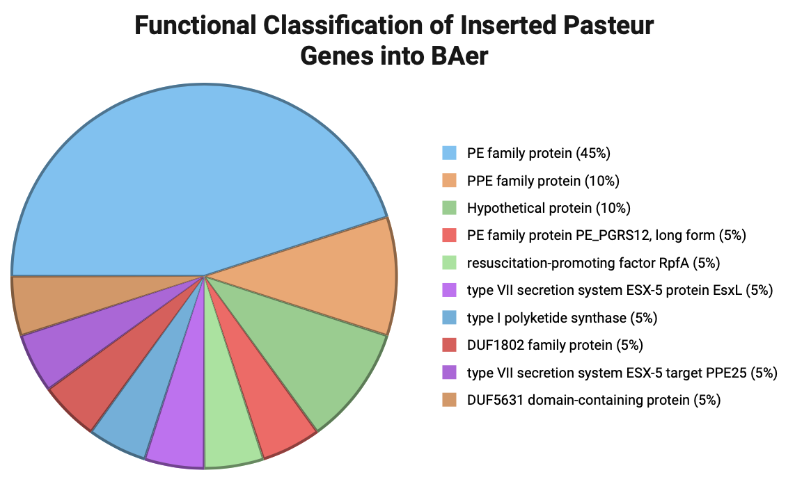
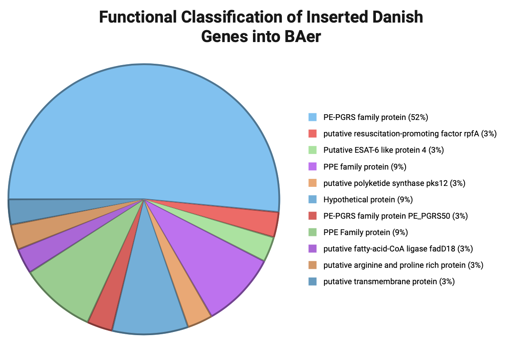
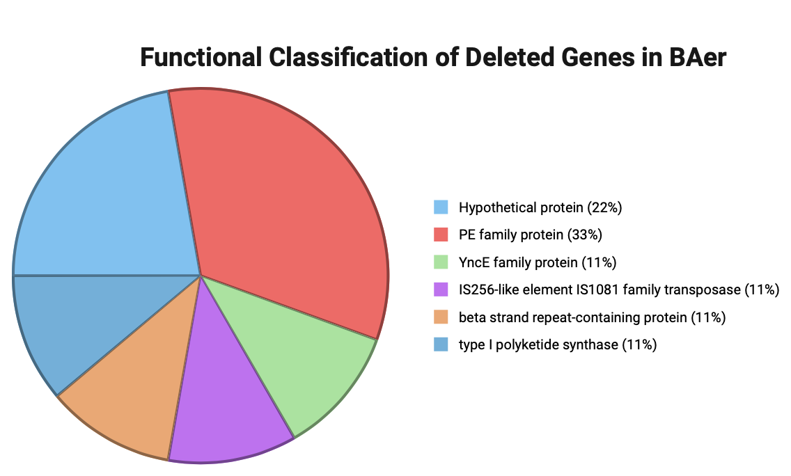

# BCG Sequencing
---

The Bacillus Calmette–Guérin (BCG) vaccine was originally developed to prevent tuberculosis; however, it is now well established as a treatment for bladder cancer and is being actively investigated for neurological and autoimmune diseases. In the Faustman Lab, we currently use the Japan BCG strain in clinical trials for type 1 diabetes (T1D). Our studies have shown that BCG can reduce blood glucose levels to near-normal ranges and reprogram glucose metabolism in lymphocytes.

In addition to Japan BCG, our lab also works with another BCG source known as Aeras BCG, which was developed by the Gates Foundation and originally reported to be sub-cultured from the Connaught BCG strain. The goal of this study was to compare the genetic sequences of Japan and Aeras BCG to accurately define their lineage and assess whether Aeras BCG could be reliably used as a substitution in future clinical trials.

To accomplish this, I optimized and performed genomic DNA isolation from both BCG strains and submitted the samples to the Harvard Bauer Core for sequencing using both short-read (Illumina) and long-read (PacBio) technologies. The resulting sequencing data were analyzed by a bioinformatics specialist. Long-read alignment was first performed by mapping Japan BCG to the Tokyo reference genome and Aeras BCG to the Connaught reference genome. A GATK-based variant-calling pipeline was then applied to identify single-nucleotide polymorphisms (SNPs), insertions, and deletions. De novo genome assemblies were also generated to further characterize structural variation. Following these analyses, I received processed datasets detailing insertion sequences, deletion events, and identified SNPs.

Using the insertion and deletion sequences identified in the Aeras BCG sample, I first determined whether the affected genes were functional or annotated as pseudogenes. Genes annotated as nonfunctional were filtered out prior to downstream analysis. Please refer to **“Insertion_BAeres_updated.pdf”** and **“Deletion_BAers_updated.pdf”** for the lists of genes retained after functional annotation filtering. After filtering out nonfunctional genes, I wrote Python codes to assess whether each sequence matched its corresponding reference sequence exactly. This analysis identified multiple regions with nucleotide-level variation. To evaluate the potential biological impact of these differences, I wrote additional functions to test whether the mutations disrupted start codons or introduced premature stop codons. Finally, I translated the DNA sequences into protein sequences and compared them to reference proteins to determine whether protein products were conserved despite underlying nucleotide changes. Please refer to **“Insertion_BAeres_bp change.pdf”** and **“Deletion_BAers_bp change.pdf”** for the lists of genes exhibiting base-pair and corresponding protein sequence changes resulting from these mutations.

Overall, we observed both insertions and deletions in the Aeras BCG genome relative to reference strains. The majority of deleted genes were annotated as pseudogenes, suggesting that few essential functions were lost. Among the deleted genes with predicted function, approximately 33% belonged to the PE protein family. In contrast, genes inserted from both the Danish and Pasteur lineages were predominantly composed of PE and PE-PGRS family members, which together accounted for more than half of all insertions. This nonrandom pattern suggests that PE/PE-PGRS regions are preferentially gained and lost, rather than randomly deleted, consistent with their known roles in host immune interaction and antigenic variation. These findings highlight biologically meaningful, strain-specific differences in the Aeras BCG genome.

 

 

 

Please refer to **“Note.pdf”** to understand the code files. 

